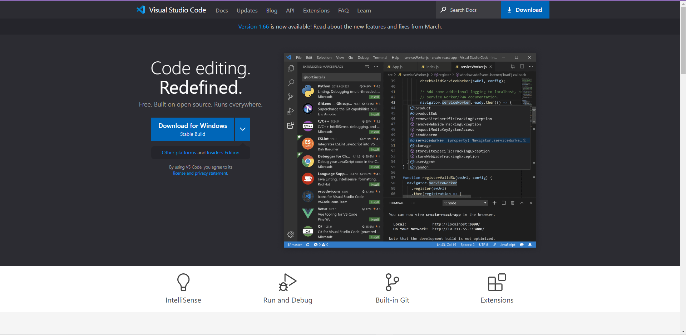

# Basics of Connecting to UCSD Remote Computers
---
## How to Run *Remote* UCSD Desktops
1) Download Visual Studio Code  
   [Link for Visual Studio Code](https://code.visualstudio.com/)  
     
   (**Download for your correct operating software**)  

2) Running Commands Through Terminal  
   Run Visual Studio Code and Add a New Terminal by Clicking Terminal on the Top Left
     
   (Drag Up the Terminal to Make it Bigger)  
     
  
3) In the Terminal, Log in to your remote Desktop with:  
   `ssh cs15lsp22@ieng.ucsd.edu`
   Between "22" and the "@" sign add your 3 letters  
   
   (For me it's "aio")
   Then Log-in with your password
   
4) This is what your Terminal should Look Like
   
    
---
## Let's Try Running Some Basic Commands
1) One basic command is `ls`
   

