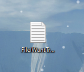

# Basics of Connecting to UCSD Remote Computers

## How To Run *Remote* UCSD Desktops
### Installing VScode
1) Download Visual Studio Code  
   [Link for Visual Studio Code](https://code.visualstudio.com/)  
     
   (**Download for your correct operating software**)  

2) Run Visual Studio Code and Add a New Terminal by Clicking Terminal on the Top Left    
     
   (Drag Up the Terminal to Make it Bigger)  
     
   
### Remotely Connecting  

3) In the Terminal, Log in to your remote Desktop with:  
   `ssh cs15lsp22@ieng.ucsd.edu`  
   Between "22" and the "@" sign add your 3 letters (For me it's "aio")  
    
   Then Log-in with your password
   
4) This is what your Terminal should Look Like  
   
    
---
## Trying Some Commands
1) One basic command is `ls`  
   
   This command will list visible directories and files
   
2) `ls -a` will show hidden files in the directory (usually begins with ".")  
   
   
3) `ls -l` will show visible files and directories with its permission on the left  
   
   
4) `cd [DIRECTORY_NAME]` will change the working directory to the directory you want to got to  
   (I did Desktop)  
   
   
5) *CTRL + D* in the terminal will log you off from the remote computer  
   
---
## Moving Files with 'scp'  

1) Once logged out, find or make a file you would like to transfer to the remote computer  
   
   
2) Then in your terminal make sure the working directory is where the file is located (For me it's in Desktop)  
   
   
3) In the terminal type in `scp FileIWantTransferred.txt cs15lsp22aio@ieng6.ucsd.edu:~/Desktop`  
   (Change FileIWantTransferred to the file name and enter your UCSD UNIX Login)  
   (After the ":~/" direct it to the directory you want the file to be. For me it's Desktop)
   
   Then enter your password
   
4) Now when you log-in to the remote computer, your file should be there
   
   
---
## Setting a SSH Key  
Everytime when we log-in or do file transfer we always have to type in our password. This slows down out productivity and is a hassle.  
We can authorize our local computer so we don't need to enter our password all the time.
---
### How to Authorize your Local Computer to the Remote Computer  
1) On your local terminal enter `ssh-keygen`  
 
 Click enter once it says "Enter file in which to save the key (C:\Users\username/.ssh/id_rsa):"
 
2) DON'T ENTER ANYTHING FOR PASSPHRASE and keep on pressing enter until it generates a key
     
   
3) Log-in to your remote computer and enter `mkdir .ssh` and log back out to your local computer  
   
   
4) In the terminal type `scp /Users/<user-name>/.ssh/id_rsa.pub cs15lsp22zz@ieng6.ucsd.edu:~/.ssh/authorized_keys`  
   This will copy the ssh key to the remote so you can log-in without a password  
   
   
5) Now when you log-in you won't need to enter password for `ssh` or `scp` everytime through the local computer
   
   
---
## Optimize Remote Running
---
1. Use the *Up-Arrow* key to go back to previous commands
  
2. Use the *TAB* key to auto-fill file names when changing directories or compiling files
  
3. Use semicolon to run multiple commands in one line  

4. Organize both local computer and remote computer so you know where everything is

